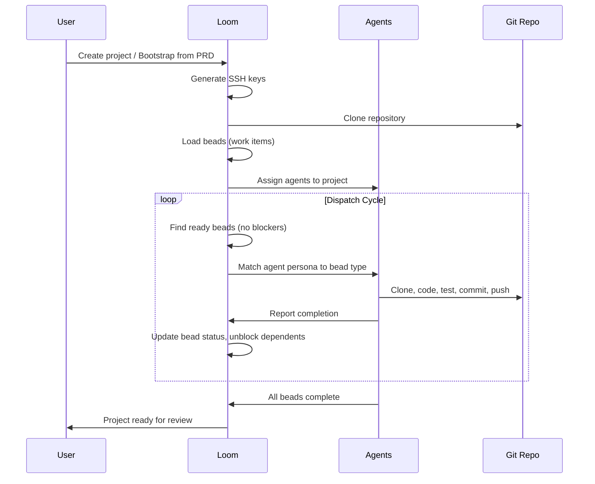

# Loom User Guide

This guide is for **users** who log in to Loom and use it to manage projects and get work done. For system setup, see [SETUP.md](../SETUP.md). For administration tasks (providers, deploy keys, users), see [ADMIN_GUIDE.md](ADMIN_GUIDE.md).

---

## Logging In

Open your browser to the Loom web UI (default: `http://localhost:8080`).

Log in with the credentials provided by your administrator. The default credentials are:

- **Username:** `admin`
- **Password:** `admin`

After login, you receive a JWT token that authenticates all subsequent requests. The web UI handles this automatically.

---

## Dashboard Overview

The Loom dashboard has several tabs:

| Tab | What It Shows |
|---|---|
| **Projects** | All registered projects with status, agents, and open work counts |
| **Agents** | Active AI agents, their personas, assigned projects, and current status |
| **Providers** | AI provider backends with health status and routing metrics |
| **Personas** | Available agent personas (roles like PM, Engineer, QA) |
| **Beads** | Work items across all projects with status and assignment |
| **Decisions** | Pending decisions that need human approval |
| **Activity** | Real-time feed of system events |
| **Analytics** | Usage statistics, cost tracking, and performance metrics |
| **CEO REPL** | Direct query interface for high-priority questions |

---

## Creating a Project

There are two ways to get a project into Loom:

### Option 1: Add an Existing Project

Use this when you have a git repository that already has code and a `.beads/` directory.

1. Click **Add Project** in the Projects tab
2. Fill in:
   - **ID**: Short identifier (e.g., `my-app`)
   - **Name**: Display name
   - **Git Repo**: Repository URL (e.g., `git@github.com:org/repo.git`)
   - **Branch**: Branch to track (e.g., `main`)
   - **Beads Path**: Path to beads directory (usually `.beads`)
   - **Git Auth Method**: `ssh` for private repos, `none` for public
3. Optional flags:
   - **Perpetual**: Project never auto-closes (good for long-lived repos)
   - **Sticky**: Project auto-loads on Loom startup
4. Click **Create**

Your administrator will need to set up the SSH deploy key — see [ADMIN_GUIDE.md](ADMIN_GUIDE.md#ssh-deploy-key-setup).

### Option 2: Bootstrap from a PRD

Use this to create a brand-new project from a Product Requirements Document. Loom will:
- Create the project
- Generate SSH keys for git access
- Break the PRD into epics and stories
- Create a Project Manager bead to start orchestration
- Assign agents and begin work

```bash
curl -X POST http://localhost:8080/api/v1/projects/bootstrap \
  -H "Content-Type: application/json" \
  -d '{
    "name": "My New App",
    "git_repo": "git@github.com:org/my-new-app.git",
    "branch": "main",
    "prd_content": "Build a REST API for user management..."
  }'
```

The response includes a public SSH key. Hand this to your administrator to register as a deploy key on the repository.

---

## The Project Lifecycle



### Project States

- **Open** — Active with ongoing work
- **Closed** — All work complete
- **Reopened** — Previously closed, new work added

### Monitoring Progress

The **Project Viewer** shows:
- Project status and readiness
- Assigned agents and their current state
- A Kanban-style view of beads (open, in-progress, blocked, closed)
- The activity feed for this project
- Comments and decisions

---

## Working with Beads

Beads are Loom's work items. They track tasks, bugs, features, and decisions.

### Bead Statuses

| Status | Meaning |
|---|---|
| `open` | Ready for work (no blockers) |
| `in_progress` | Assigned to an agent, actively being worked |
| `blocked` | Waiting on another bead to complete |
| `closed` | Completed |

### Viewing Beads

```bash
# All beads
curl http://localhost:8080/api/v1/beads

# Beads for a specific project
curl http://localhost:8080/api/v1/beads?project_id=my-project

# Single bead with full details
curl http://localhost:8080/api/v1/beads/bead-123
```

### Bead Fields

| Field | Description |
|---|---|
| `id` | Unique identifier |
| `title` | Short description of the work |
| `type` | `task`, `bug`, `feature`, `epic`, `decision` |
| `status` | Current status |
| `priority` | P0 (critical) through P4 (backlog) |
| `assigned_to` | Agent currently working on it |
| `blocked_by` | Bead IDs that must complete first |
| `blocks` | Bead IDs waiting on this one |
| `project_id` | Which project this belongs to |

### Dependencies

Beads can depend on other beads. A bead with unresolved `blocked_by` entries won't be dispatched until its blockers are closed. The work graph view shows these relationships visually.

---

## Working with Decisions

Some situations require human judgment. When an agent encounters an ambiguous requirement, a conflict, or a high-impact choice, it creates a **decision bead**.

### Reviewing Decisions

1. Navigate to the **Decisions** tab
2. Review the question, options, and context provided by the agent
3. Select your choice and submit

Or via API:

```bash
# List pending decisions
curl http://localhost:8080/api/v1/decisions

# Resolve a decision
curl -X PUT http://localhost:8080/api/v1/decisions/decision-123 \
  -H "Content-Type: application/json" \
  -d '{
    "resolution": "yes",
    "resolved_by": "admin",
    "comment": "Approved — proceed with option A"
  }'
```

Decisions have a 48-hour default timeout. Unresolved decisions block dependent work.

---

## CEO REPL

The CEO REPL is a direct query interface for high-priority questions. It routes your question through the best available provider using the Loom system persona.

1. Navigate to the **CEO REPL** tab
2. Type your question and click **Send**
3. Review the response, which includes the provider and model used

Use this for quick system-level queries, architecture questions, or priority decisions.

---

## Activity Feed and Notifications

### Activity Feed

The activity feed shows all events across your projects:

- Bead creation, assignment, and completion
- Agent spawning and status changes
- Decision creation and resolution
- Project state changes

Access it in the **Activity** tab or via API:

```bash
# Recent activity
curl http://localhost:8080/api/v1/activity-feed

# Filter by project
curl http://localhost:8080/api/v1/activity-feed?project_id=my-project

# Real-time stream
curl -N http://localhost:8080/api/v1/activity-feed/stream
```

Similar events within a 5-minute window are automatically aggregated (e.g., 5 beads created by one agent show as a single grouped entry).

### Notifications

Notifications alert you to events that need your attention:

```bash
# Get notifications (requires auth)
curl -H "Authorization: Bearer $TOKEN" \
  http://localhost:8080/api/v1/notifications

# Unread only
curl -H "Authorization: Bearer $TOKEN" \
  http://localhost:8080/api/v1/notifications?status=unread

# Mark as read
curl -X POST -H "Authorization: Bearer $TOKEN" \
  http://localhost:8080/api/v1/notifications/{id}/read

# Mark all read
curl -X POST -H "Authorization: Bearer $TOKEN" \
  http://localhost:8080/api/v1/notifications/mark-all-read
```

You receive notifications for:
- Direct assignments (beads or decisions assigned to you)
- Critical priority (P0) bead creation
- Decisions requiring your input
- System alerts (provider failures, workflow errors)

### Notification Preferences

```bash
curl -X PATCH -H "Authorization: Bearer $TOKEN" \
  -H "Content-Type: application/json" \
  -d '{
    "enable_in_app": true,
    "subscribed_events": ["bead.assigned", "decision.created"],
    "min_priority": "high",
    "quiet_hours_start": "22:00",
    "quiet_hours_end": "08:00",
    "digest_mode": "realtime"
  }' \
  http://localhost:8080/api/v1/notifications/preferences
```

---

## Pair-Programming Mode

Pair-programming mode lets you chat interactively with an AI agent about a specific bead. Unlike async dispatch (where agents work autonomously), pair mode is a real-time conversation.

### When to Use Pair Mode

- Clarifying complex requirements before an agent starts work
- Collaborating on tricky implementation details
- Reviewing agent work in progress and providing guidance
- Debugging issues together with an agent

### Starting a Pair Session

1. Open a bead in the **Bead Viewer**
2. Click the **Pair** button in the bead modal
3. Select an agent from the dropdown
4. Type your message and send

The agent responds in real-time via streaming, with full context of the bead. The agent can also execute actions (read/write files, search code) during the conversation.

### Conversation Persistence

Chat history is saved per-bead and persists across modal reopens. Previous messages are visible when you return to a bead's pair session.

### API Usage

```bash
# Start a pair session (SSE stream)
curl -N -X POST http://localhost:8080/api/v1/pair \
  -H "Content-Type: application/json" \
  -d '{
    "bead_id": "bead-123",
    "agent_id": "agent-456",
    "message": "How should we approach the auth middleware?"
  }'
```

---

## Getting Results

When agents complete work:

1. **Code** is committed and pushed to the project's git repository
2. **Beads** are marked closed with completion notes
3. **Artifacts** (test results, build output) are logged in the activity feed
4. **The project state** updates to reflect progress

Check the Project Viewer to see overall completion. When all beads are closed, the project can be closed (or stays open if marked perpetual).

---

## FAQ

**Q: Beads aren't being picked up. What's wrong?**
A: Check that agents are assigned to the project, the project's git access is working (`readiness_ok: true`), and beads aren't blocked by unresolved dependencies.

**Q: How do I add more agents to a project?**
A: Use the API: `POST /api/v1/projects/{id}/agents` with `{"agent_id": "...", "action": "assign"}`. Or ask your administrator.

**Q: A decision has been waiting for days. What happens?**
A: Decisions timeout after 48 hours by default. The system may escalate or auto-resolve depending on the decision type.

**Q: Can I manually create beads?**
A: Yes, via API: `POST /api/v1/beads` with the bead details. Or use the `bd` CLI in the project's git working directory.

**Q: How do I see what an agent is doing right now?**
A: Check the agent's status in the Agents tab, or stream real-time events: `curl -N http://localhost:8080/api/v1/events/stream?type=agent.status_change`.

**Q: Dispatch keeps redispatching the same bead. Is something wrong?**
A: If a bead is dispatched more than `max_hops` times (default 20), it's escalated to P0 and a CEO decision is created. This usually means the bead's requirements are unclear or the agent can't complete it. Review and clarify the bead description.
